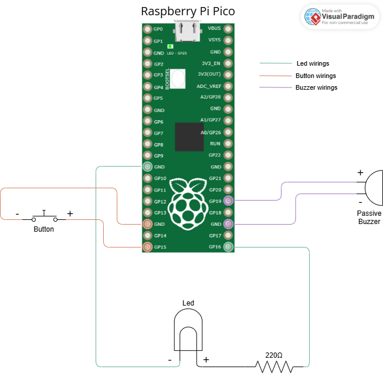

# &#128064; Reaction-Tester project on Raspberry Pi Pico &#128341;

Course project for Real-Time Embedded Systems university course which leverages concepts such as concurrency and inter-process(/thread) communication (in this specific case performed in message-passing fashion).   
The project aims to be a fun mini-game to test the user's reaction time from the moment the led turns on. If the user beats the best time (within the current session) the buzzer will make a sound to notify that a new time record has been set!

## Getting Started

Here is a quick guide to compile and execute the project presented in this repository.

### Circuit schema

Given the needed hardware (Raspberry Pi Pico microcontroller, a led, a 220Ω resistor, a passive buzzer, a button, 6 wires and a breadboard), here's a diagram showing how to connect the components in order to make them work properly



Once the wirings are all set it is possible to connect the Raspberry Pi Pico to your PC and follow the next steps of the guide to launch the project

### Downloading the project

The first step needed is the download of the project from this repository, which can be eaily done by opening a terminal (preferably Linux-based) and executing the series of commands below:
```bash
# Move to your desired folder
git clone https://github.com/andreamonacelli/pico-reaction-tester
```

The project is now downloaded in *\<your-folder-name\>/pico-reaction-tester*

### Cloning and binding the Pico SDK

In order to launch a project on a Raspberry Pi Pico you need to clone the Pico SDK and bind it to a specific environment variable

```bash
# Installing the toolchain
sudo apt install cmake python3 build-essential gcc-arm-none-eabi libnewlib-arm-none-eabi libstdc++-arm-none-eabi-newlib

# Clone the SDK repository
git clone https://github.com/raspberrypi/pico-sdk

# To bind permanently the PICO_SDK_PATH environment variable
echo “export PICO_SDK_PATH={path-to}/pico-sdk” >> ~/.bashrc
# Or else EACH TIME that the PC/VM/WSL is turned on
export PICO_SDK_PATH={path-to}/pico-sdk
```

### ROS2 Installation (needed to install and configure microROS and also for the Python logger)

Moving on, we need to install ROS2 in order to be able to let the Pico communicate the results to the host (which will correspond to the user's PC).   
The installation can be easily done by following the official guide [here](https://docs.ros.org/en/jazzy/Installation/Ubuntu-Install-Debs.html) for ROS and [here]() for microROS, however I will report the commands in this quick-start guide as well
```bash
# First of all make sure that your system has a locale that supports UTF-8 (refer to official guide to see how to perform this check)

# Enable required repositories
sudo apt install software-properties-common
sudo add-apt-repository universe

# Install the ros2-apt-source to configure ROS2 repositories
sudo apt update && sudo apt install curl -y
export ROS_APT_SOURCE_VERSION=$(curl -s https://api.github.com/repos/ros-infrastructure/ros-apt-source/releases/latest | grep -F "tag_name" | awk -F\" '{print $4}')
curl -L -o /tmp/ros2-apt-source.deb "https://github.com/ros-infrastructure/ros-apt-source/releases/download/${ROS_APT_SOURCE_VERSION}/ros2-apt-source_${ROS_APT_SOURCE_VERSION}.$(. /etc/os-release && echo $VERSION_CODENAME)_all.deb" # If using Ubuntu derivates use $UBUNTU_CODENAME
sudo dpkg -i /tmp/ros2-apt-source.deb

# Update apt repository caches
sudo apt update
sudo apt upgrade

# Actual installation of ROS2
sudo apt install ros-jazzy-desktop
```

### microROS installation and configuration

Once ROS2 is correctly installed, we can move forward with the installation of microROS, which can be performed by executing the following commands

```bash
# Create a workspace and download the micro-ROS tools
mkdir microros_ws
cd microros_ws
git clone -b $ROS_DISTRO https://github.com/micro-ROS/micro_ros_setup.git src/micro_ros_setup

sudo apt update
sudo apt upgrade

# Update dependencies using rosdep
sudo apt-get install python3-rosdep
sudo rosdep init
sudo apt update && rosdep update
rosdep install --from-paths src --ignore-src -y

# Install pip
sudo apt-get install python3-pip

# Build micro-ROS tools and source them
sudo apt install colcon
colcon build
source install/local_setup.bash
```

### Launch the project

To launch the project you need to execute the following commands

```bash
# ---- ONLY ON HOST-STARTUP ----
# Setup ROS2 Environment (needed mainly for the Python logger)
source /opt/ros/jazzy/setup.bash

# ---- ONLY ON HOST-STARTUP ----
# Build microROS
source {path-to-microros_workspace}/install/local_setup.bash

# Build the microROS agent
ros2 run micro_ros_setup build_agent.sh # To be executed in microros_workspace folder

# After connecting the Pico to the PC execute the following line only if you're working in a WSL in the Windows terminal
usbipd attach -a --wsl --busid {busid}

#Once the interface is bound execute the microROS agent and launch the program on Pico
sudo ros2 run micro_ros_agent micro_ros_agent serial --dev /dev/ttyACM0

#(Optional) launch the Python logger
python3 ROS2_logger/reaction_tester_host_node.py
```